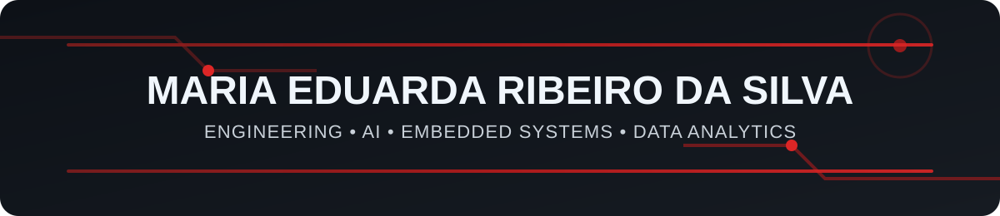

<!-- ===================================================== -->
<!--                  PROFILE BANNER                       -->
<!-- ===================================================== -->

<p align="center">
  
</p>

<br>

<!-- ===================================================== -->
<!--                     CONTACT                           -->
<!-- ===================================================== -->

<div align="center">

<a href="https://www.linkedin.com/in/eduarda-ribeiro-409646313">
  
</a>


</div>

<br>

---

## 👩‍💻 About Me

I am passionate about **technology and engineering**, with experience in software development, artificial intelligence, data science and embedded systems.

My interests lie at the intersection of **engineering, hardware and software**, developing projects that range from programming and data analysis to **FPGA, digital systems, RISC-V and intelligent applications**.

I enjoy exploring new technologies and turning technical knowledge into practical projects and solutions.

---

## ⚙️ What I Do

<table width="100%">
<tr>

<td width="25%" align="center">

### ⚙️ Engineering

Digital Systems  
Electronics  
Hardware & Software  

</td>

<td width="25%" align="center">

### 🤖 AI & Data

Artificial Intelligence  
Machine Learning  
Data Analytics  

</td>

<td width="25%" align="center">

### 🔌 Embedded Systems

FPGA  
VHDL / Verilog  
RISC-V  

</td>

<td width="25%" align="center">

### 💻 Software

Python & C  
Web Development  
Backend & Frontend  

</td>

</tr>
</table>

---

## 🛠️ Technologies & Tools

<div align="center">

### Programming


<br>

### Web Development


<br>

### Database & Tools


</div>

<br>

---

## 🔬 Engineering & Embedded Systems

<div align="center">


</div>

<br>

---

## 🚀 Featured Areas

<div align="center">


</div>

<br>

---

## 📌 Featured Projects

<table width="100%">

<tr>

<td width="50%" valign="top">

### 🤖 Artificial Intelligence & RAG

Projects involving **Artificial Intelligence, data analysis, machine learning and Retrieval-Augmented Generation (RAG)**.

**Technologies:**  
`Python` `Machine Learning` `Data Analysis` `RAG`

</td>

<td width="50%" valign="top">

### ⚙️ RISC-V & FPGA

Development and study of digital systems involving **RISC-V architecture, FPGA, VHDL and Verilog**.

**Technologies:**  
`RISC-V` `FPGA` `VHDL` `Verilog`

</td>

</tr>

<tr>

<td width="50%" valign="top">

### 📊 Data Science

Data exploration, analysis, machine learning models and development of **data-driven solutions and dashboards**.

**Technologies:**  
`Python` `Pandas` `Machine Learning` `Data Analytics`

</td>

<td width="50%" valign="top">

### 🌐 Software Development

Development of web applications and software solutions using modern frontend and backend technologies.

**Technologies:**  
`Laravel` `Vue.js` `JavaScript` `PostgreSQL`

</td>

</tr>

</table>

---

## 🎯 Currently Exploring

<div align="center">

`Artificial Intelligence` • `Embedded Systems` • `FPGA` • `RISC-V` • `Data Science` • `Engineering`

</div>

<br>

---

## 📫 Connect With Me

<div align="center">

<a href="https://www.linkedin.com/in/eduarda-ribeiro-409646313">
  
</a>

<br><br>

📍 São Luís, Maranhão — Brazil

</div>

<br>

<div align="center">

**Engineering • Technology • Innovation**

</div>
```
